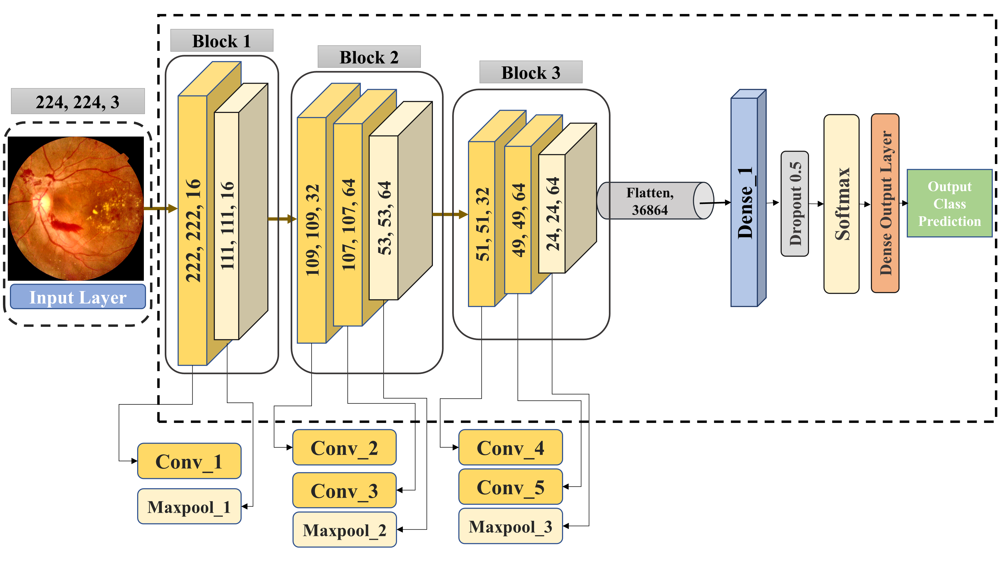

# RetNet-10: A Lightweight Deep Learning Model for Diabetic Retinopathy Image Classification

📚 This repository contains the original implementation of RetNet-10 for classifying a wide range of Diabetic Retinopathy Images.

📧 **Contact**: For inquiries, you can reach out to us at m.raiaan.cs@gmail.com.

## Paper

📄 This code implements the paper published in a Q1 Journal, IEEE Access, with an impact factor of 3.47 and an H-INDEX of 204:

**Title**: [A Lightweight Robust Deep Learning Model Gained High Accuracy in Classifying a Wide Range of Diabetic Retinopathy Images](https://ieeexplore.ieee.org/abstract/document/10113630)

**Authors**: Mohaimenul Azam Khan Raiaan, Kaniz Fatema, Inam Ullah Khan, Sami Azam, Md. Rafi Ur Rashid, Md. Saddam Hossain Mukta, Mirjam Jonkman, Friso De Boer

**Year**: 2023

**DOI**: [10.1109/ACCESS.2023.3272228](https://doi.org/10.1109/ACCESS.2023.3272228)

## Dataset Availability

This project uses the following datasets for Diabetic Retinopathy Images:

- [APTOS Dataset](https://www.kaggle.com/c/aptos2019-blindness-detection)
- [Messidor-2 Dataset](https://www.adcis.net/en/third-party/messidor2/)
- [IDRiD Dataset](https://ieee-dataport.org/open-access/indian-diabetic-retinopathy-image-dataset-idrid)

## Code

You can find the implementation of RetNet-10 in the following file:

- [RetNet-10 Model.py](Models/RetNet-10%20Model.py)

## Model Architecture



## Citation Request

If you find this work helpful for your research, please consider citing our paper:
   - Cite:
     ```bibtex
     @ARTICLE{10113630,
       author={Raiaan, Mohaimenul Azam Khan and Fatema, Kaniz and Khan, Inam Ullah and Azam, Sami and Rashid, Md. Rafi Ur and Mukta, Md. Saddam Hossain and Jonkman, Mirjam and De Boer, Friso},
       journal={IEEE Access},
       title={A Lightweight Robust Deep Learning Model Gained High Accuracy in Classifying a Wide Range of Diabetic Retinopathy Images},
       year={2023},
       volume={11},
       number={},
       pages={42361-42388},
       doi={10.1109/ACCESS.2023.3272228}
     }
     ```


## Copying

This code is shared for research use only. If you encounter any issues or find inappropriate content in this code, please feel free to contact us.

## License

This project is licensed under a Creative Commons License.
